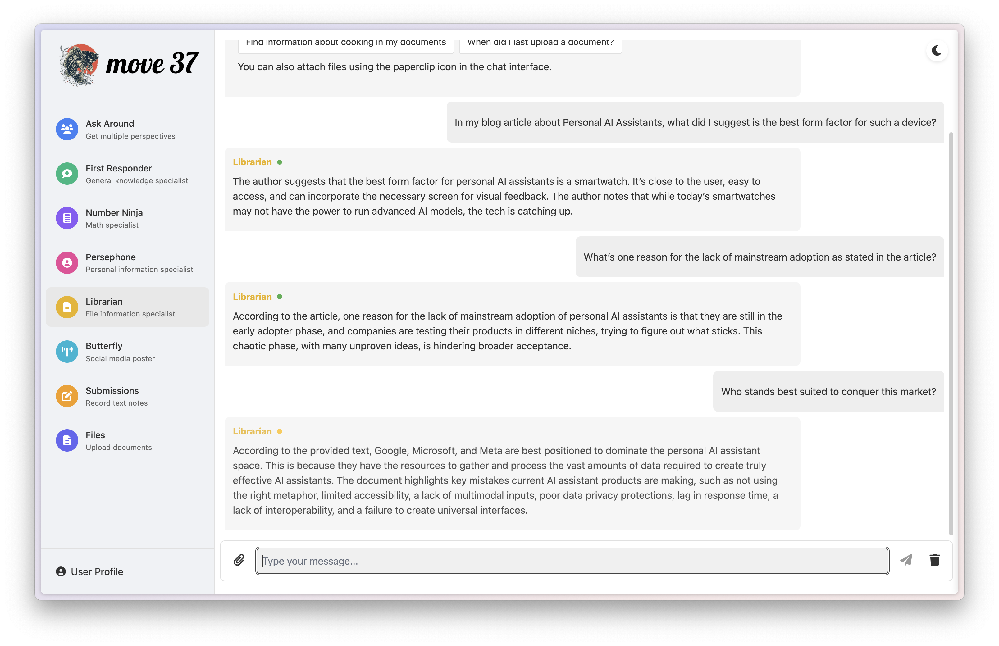

We are at the beginning of a new goal-based paradigm of computing where you can simply describe what you need done without having to think about the steps you need to perform in between to achieve that task. You can describe the "what", because computers are smart enough to figure out the "how" in order to perform the task. This project is an attempt to make that reality come true.

To begin with, this project offers some of the popular features that other commercial products are offering including taking down meeting notes as well as performing some tasks on the computer, but all run locally, with user privacy in mind.

There are numerous reasons for why this application is architected the way it is, ensuring that the data resides only on the user's computer within the user's control. Read more about that [here](https://redd.in/blog/the-age-of-goal-based-computing/)

This project is entirely free for personal use but is covered by a license to ensure fair commercial usage. Please review the license file (license.md) for further details.

## Features

### 1. Get quick answers from a general purpose AI model


### 2. Calculate with accuracy, better than LLMs can


### 3. Tap into personal knowledge and get answers tailored to you


### 4. Upload your own files and ask questions of them



### 5. Make posting to all your social media accounts a breeze


### 6. Record anything, including meeting notes, document information or anything else and recall them when you need


### 7. View all the things recorded about you and delete anything, any time


### 8. Upload your own files so you can ask any question about them


### 9. The quickest way to ask questions and get the answer from multiple sources or to get multiple perspectives


### 10. Dark mode, of course


### 11. Mobile compatible


---


## Quick Installation

Prerequisites -- you need Python 3.11 and Ollama installed on your local machine with Qwen2.5, mxbai-embed-large and phi4-mini installed. 

1. Clone the repository and then go into that directory:
```bash
git clone https://github.com/sharan01x/move37.git
cd move37
```

2. Make the starting shell script executable:
```bash
chmod +x start.sh
```

3. Now launch the application using:
```bash
./start.sh
```

When it runs for the first time, it should run all the installation steps necessary to get your application working. If this doesn't result in a clean start up of the application post that, use the following steps to install it manually first and then use the start.sh script to launch your application post that.

---

## Manual Install (If Quick Install Doesn't Work)

1. Make sure you have Python 3.11 installed on your system. If you don't have python, go get it from their [website](https://www.python.org/downloads/release/python-31112/)

2. Install Ollama and Qwen2.5, mxbai-embed-large and phi4-mini AI models. Go to their website to [begin](https://ollama.com).

3. Clone the Move37 repository and then go into that directory:
```bash
git clone https://github.com/sharan01x/move37.git
cd move37
```

4. Create a virtual environment and install dependencies:
```bash
python3.11 -m venv venv
source venv/bin/activate  # On Windows: venv\Scripts\activate
pip install -r requirements.txt
```
You will need to install some depencies manually post that using the following command in the terminal:

```bash
python3.11 -m spacy download en_core_web_sm
```
If you run into issues, look at the instructions within requirements.txt for alternative ways to fix the install process.

5. Setup the launch script for easy launches in the future:
```bash
chmod +x start.sh
```

6. [OPTIONAL] For social media posting using Butterfly, you need the following two things:

a. A folder with the UI elements that need to be clicked to be able to post using the GUI. This is available for download from https://www.redd.in/resources.html.

b. A file with the social media account details at data/social_media/accounts.json. Use the following structure for the various supported platforms:

```
[
  {
    "id": "twitter_company1",
    "channel_id": "twitter",
    "name": "company1",
    "type": "company",     ///OPTIONS ARE company, personal, anonymous
    "character_limit": 280,
    "max_image_size": 5242880,
    "settings": {
      "api_key": "YOUR_API_KEY",
      "api_key_secret": "YOUR_API_KEY_SECRET",
      "access_token": "YOUR_ACCESS_TOKEN",
      "access_token_secret": "YOUR_ACCESS_TOKEN_SECRET",
      "posting_url": "https://x.com"
    }
  },
  {
    "id": "bluesky_company1",
    "channel_id": "bluesky",
    "name": "company1",
    "type": "company",
    "character_limit": 280,
    "settings": {
      "handle": "company1.bsky.social",
      "password": "YOUR_PASSWORD",
      "max_image_size": 1000000
    }
  },
  {
    "id": "lens_personal1",
    "channel_id": "lens",
    "name": "personal1",
    "type": "personal",
    "character_limit": 300,
    "settings": {
      "posting_url": "https://hey.xyz"
    }
  },
  {
    "id": "mastodon_personal1",
    "channel_id": "mastodon",
    "name": "personal1",
    "type": "personal",
    "character_limit": 300,
    "settings": {
      "access_token": "YOUR_ACCESS_TOKEN",
      "api_base_url": "https://mastodon.social",
      "redirect_uri": "http://localhost:5000/mastodon_callback",
      "max_image_size": 8388608
    }
  },
  {
    "id": "farcaster_personal1",
    "channel_id": "farcaster",
    "name": "personal1",
    "type": "personal",
    "character_limit": 280,
    "settings": {
      "mnemonic": "YOUR_MNEMONIC_PHRASE",
      "posting_url": "https://warpcast.com"
    }
  },
  {
    "id": "linkedin_personal1",
    "channel_id": "linkedin",
    "name": "personal1",
    "type": "personal",
    "character_limit": 3000,
    "settings": {
      "posting_url": "https://www.linkedin.com/feed/"
    }
  },
  {
    "id": "linkedin_company1",
    "channel_id": "linkedin",
    "name": "company1",
    "type": "company",
    "character_limit": 3000,
    "settings": {
      "posting_url": "https://www.linkedin.com/company/YOUR_COMPANY_ID/admin/page-posts/published/?share=true"
    }
  }
]
```

7. Launch the application in the future simply by using the following command:
```bash
./start.sh
```
The first time this runs, some frotnend dependencies will be installed, but all the future runs will be faster and immediately run the two servers to get your application to run.
