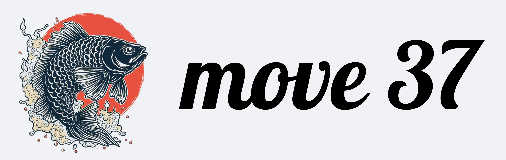

We are at the beginning of a new goal-based paradigm of computing where you can simply describe what you need done without having to think about the steps you need to perform in between to achieve that task. You can describe the "what", because computers are smart enough to figure out the "how" in order to perform the task. This project is an attempt to make that reality come true.

There are numerous reasons for why this application is architected the way it is, ensuring that the data resides only on the user's computer within the user's control. But that will be covered separately. 

This project is entirely free for personal use but is covered by a license to ensure fair commercial usage. Please review the license file (license.md) for further details.


## Installation

1. Clone the repository:
```bash
git clone https://github.com/sharan01x/move37.git
cd move37
```

2. Check configuration file for the right paths or to change the AI models that you prefer to use. Leave this as is if you want to use the default settings, in which case, ,make sure you already have Ollama installed and running Qwen2.5, mxbai-embed-large and phi4-mini. 

3. Create a virtual environment and install dependencies:
```bash
python -m venv venv
source venv/bin/activate  # On Windows: venv\Scripts\activate
pip install -r requirements.txt
```
You will need to install some depencies manually, and they are detailed in the requirements.txt file.


4. Run the application:
```bash
python main.py --host 0.0.0.0
```

5. Access the frontend:
```bash
cd frontend
python -m http.server 3000
```

6. [OPTIONAL] For social media posting using Butterfly, you need the following two things:
a. A folder with the UI elements that need to be clicked to be able to post using the GUI. This is available for download from https://www.redd.in/resources.html
b. A file with the social media account details at data/social_media/accounts.json. You can have one or more accounts use the following structure for the various supported platforms:

```
[
  {
    "id": "twitter_company1",
    "channel_id": "twitter",
    "name": "company1",
    "type": "company",     ///OPTIONS ARE company, personal, anonymous
    "character_limit": 280,
    "max_image_size": 5242880,
    "settings": {
      "api_key": "YOUR_API_KEY",
      "api_key_secret": "YOUR_API_KEY_SECRET",
      "access_token": "YOUR_ACCESS_TOKEN",
      "access_token_secret": "YOUR_ACCESS_TOKEN_SECRET",
      "posting_url": "https://x.com"
    }
  },
  {
    "id": "bluesky_company1",
    "channel_id": "bluesky",
    "name": "company1",
    "type": "company",
    "character_limit": 280,
    "settings": {
      "handle": "company1.bsky.social",
      "password": "YOUR_PASSWORD",
      "max_image_size": 1000000
    }
  },
  {
    "id": "lens_personal1",
    "channel_id": "lens",
    "name": "personal1",
    "type": "personal",
    "character_limit": 300,
    "settings": {
      "posting_url": "https://hey.xyz"
    }
  },
  {
    "id": "mastodon_personal1",
    "channel_id": "mastodon",
    "name": "personal1",
    "type": "personal",
    "character_limit": 300,
    "settings": {
      "access_token": "YOUR_ACCESS_TOKEN",
      "api_base_url": "https://mastodon.social",
      "redirect_uri": "http://localhost:5000/mastodon_callback",
      "max_image_size": 8388608
    }
  },
  {
    "id": "farcaster_personal1",
    "channel_id": "farcaster",
    "name": "personal1",
    "type": "personal",
    "character_limit": 280,
    "settings": {
      "mnemonic": "YOUR_MNEMONIC_PHRASE",
      "posting_url": "https://warpcast.com"
    }
  },
  {
    "id": "linkedin_personal1",
    "channel_id": "linkedin",
    "name": "personal1",
    "type": "personal",
    "character_limit": 3000,
    "settings": {
      "posting_url": "https://www.linkedin.com/feed/"
    }
  },
  {
    "id": "linkedin_company1",
    "channel_id": "linkedin",
    "name": "company1",
    "type": "company",
    "character_limit": 3000,
    "settings": {
      "posting_url": "https://www.linkedin.com/company/YOUR_COMPANY_ID/admin/page-posts/published/?share=true"
    }
  }
]
```

Then open your browser to http://localhost:3000

## Documentation

More detailed documentation is coming soon.


## Features

- **Multi-agent support**: Users can interact with different specialized agents
- **Real-time communication**: WebSocket ensures instant message delivery and responses
- **Offline resilience**: Reconnection handling with exponential backoff
- **File attachments**: Support for sending files through the chat interface
- **User identity management**: Persistent user ID stored in localStorage